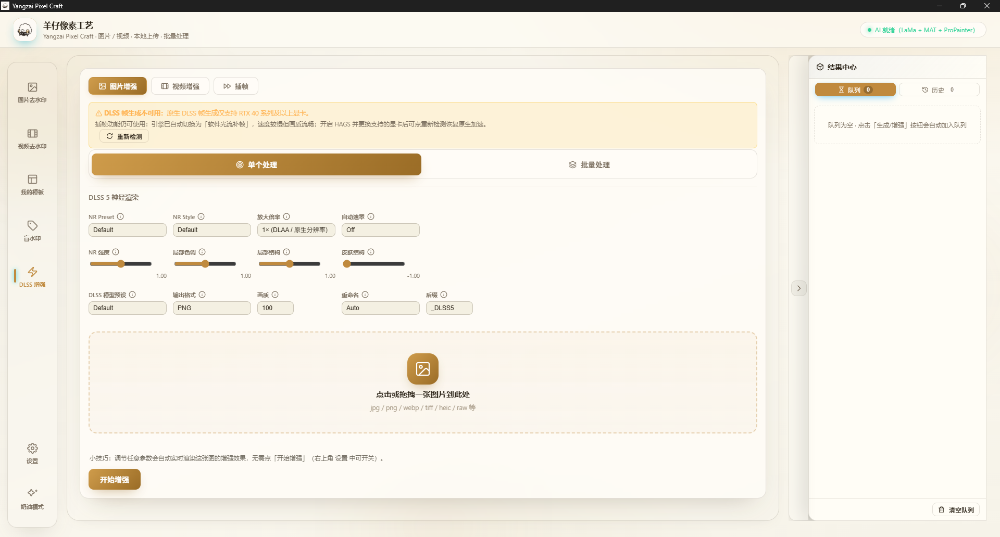
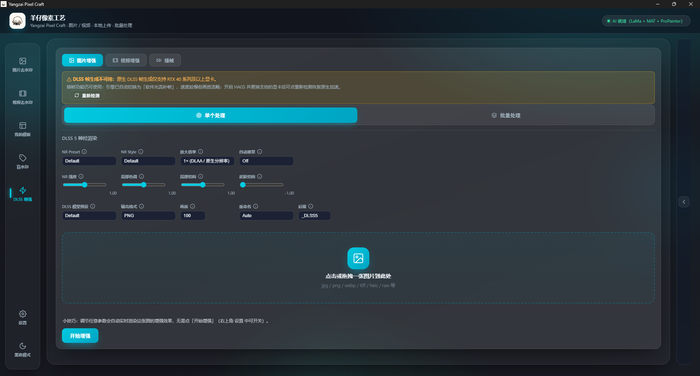
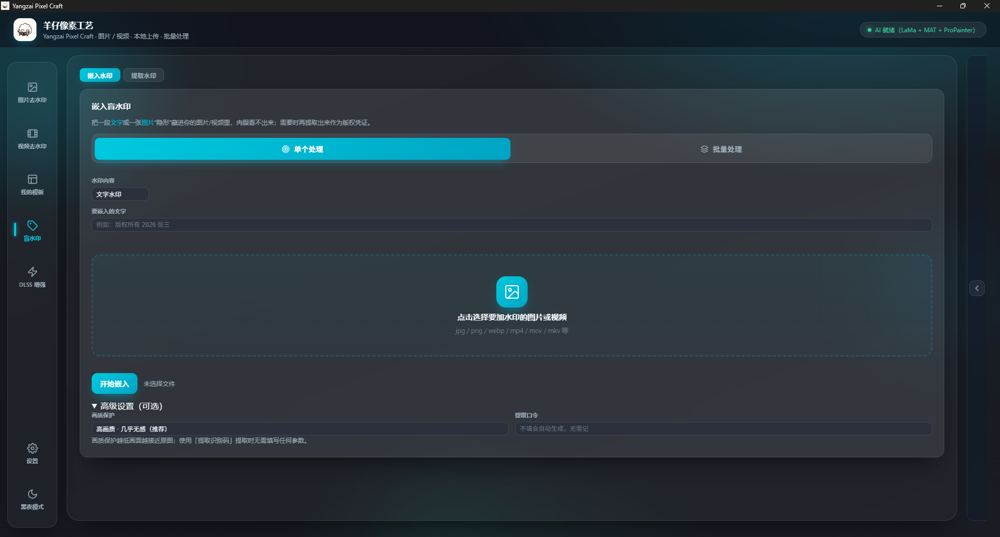
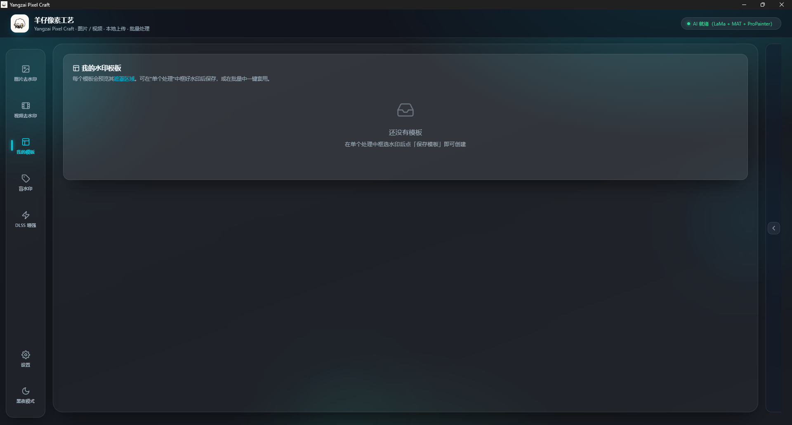
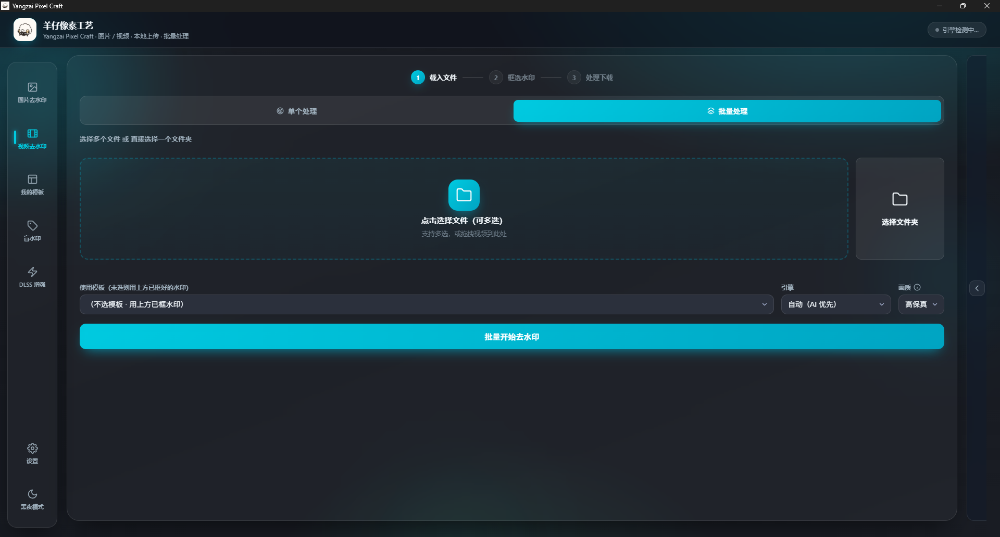
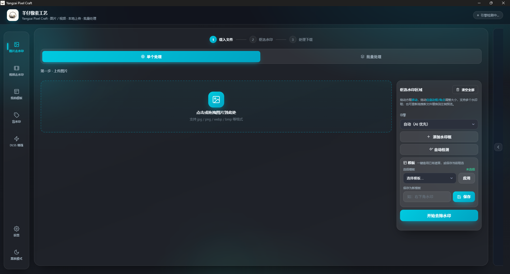

# Yangzai Pixel Craft（羊仔像素工艺）

一款面向视频/图片处理的桌面工具，内置 **DLSS 超分增强**、**AI 物体/区域去水印**、**视频盲水印嵌入与提取**三大能力，全程本地运行、数据不出本机。

---

## 功能一览

### **界面展示**













### 功能说明

| 功能 | 说明 |
| --- | --- |
| 🚀 DLSS 增强 | 视频/图片超分放大（1.5×/1.7×/2×/3×），参数可调，实时预览出图 |
| 🧹 AI 去水印 | 在画面任意位置框选目标，LaMa/MAT/OpenCV 多引擎智能擦除并重绘 |
| 🔏 盲水印 | 文字/图片水印嵌入视频或图片；嵌入后可凭提取识别码一键还原 |
| ⚡ GPU 加速 | 盲水印嵌入走 GPU 批量计算；视频重封装走 NVENC 硬件编码 |
| 🛟 增强兜底 | 显卡不支持神经超分时自动改用「高质量放大 + DLAA 神经原生增强」，绝不输出黑帧 |
| ⏱ 实时进度反馈 | 实时预览、批量处理均显示明确进度与等待提示 |

---

## 环境要求

- **系统**：Windows 10/11（支持 Edge 内核）
- **显卡（可选）**：NVIDIA 显卡 + CUDA 12.x 运行库，用于 AI 去水印与 GPU 盲水印嵌入加速；无独显也可通过 CPU 运行
- **Python（源码运行）**：3.11

---

## 一、源码运行

```bash
# 1. 进入项目目录
cd video-watermark-remover

# 2. 安装 Python 依赖
pip install -r requirements.txt

# 3. 启动桌面应用（启动后会自动拉起原生窗口，也可在浏览器访问首页）
python desktop.py
```

> `desktop.py` 既是入口，也是唯一入口：它启动 FastAPI 后台 + pywebview 原生窗口。

### GPU 盲水印加速（可选）

若已正确安装 cupy 且自检通过，嵌入会自动使用 GPU 批量计算。

- 需要 NVIDIA 显卡与 CUDA 12 运行库（与 torch cu121 同环境）
- 安装对应 cupy 版本（本环境 numpy 为 1.26.4，须用 13.x）：

```bash
python -m pip install "cupy-cuda12x<14"
```

> 未安装 / 无 GPU / 自检异常时，嵌入会自动、静默回退到 CPU 多进程，功能不受影响。

---

## 二、命令行使用（可选）

前端与后端均为本地 HTTP 服务，启动 `desktop.py` 后即可在浏览器使用。也可查看后端 `backend/main.py` 开放的 API。

---

## 三、打包为 Windows exe

一键打包脚本（含 torch / AI 去水印 / GPU 支持）：

```bat
pack.bat
```

产物输出到 `dist\yangzai\`，运行 `dist\yangzai\Yangzai Pixel Craft.exe` 即可。

### 打包说明

- onedir 模式，`exe` 旁会外置 `backend / frontend / model / dlss / lib / data` 等目录，**分发时需随 exe 一起带上**。
- 盲水印 GPU 加速所需 `cupy` 与 `_wm_gpu` 模块已纳入打包配置（`watermark_app.spec`）。
- 打包后如需改动前端/后端逻辑，可只同步对应文件到 `dist\yangzai\` 对应目录，不必整体重打；但涉及新增依赖时请重新运行 `pack.bat`。

---

## 四、目录结构

```
video-watermark-remover/
├── desktop.py           # 入口：FastAPI 后台 + pywebview 窗口
├── pack.bat             # 一键打包脚本
├── watermark_app.spec   # PyInstaller 打包配置
├── backend/             # FastAPI 后端接口与处理逻辑
│   ├── watermark_api.py # 盲水印嵌入/提取接口（GPU 优先、CPU 回退）
│   ├── _wm_gpu.py       # GPU 批量盲水印嵌入核心（DWT/DCT/SVD）
│   ├── enhance_api.py   # DLSS 增强接口
│   ├── processor.py     # 视频处理
│   └── main.py          # 应用主服务
├── frontend/            # 前端页面（index.html / app.js / styles.css）
├── lib/                 # 第三方/私有库（含盲水印库）
├── model/               # AI/深度学习模型文件
├── dlss/                # DLSS 解码相关资源
├── data/                # 运行期数据（任务、上传、输出、水印等）
└── dist/yangzai/        # 打包产物
```

---

## 五、常见问题

**Q：增强/去水印为什么慢？**
A：AI 处理依赖 GPU 与模型首载，首次使用需加载模型；任务运行中会主动暂停自动预览以优先保证成片速度，此时页面会给出明确提示。

**Q：实时预览没有进度提示？**
A：预览请求发出后，页面上方固定提示条与预览区内会同步显示「正在生成预览… Ns」；GPU 被占用时会变为「GPU 忙碌中，正在等待空闲… Ns」。若完全无提示，可能是缓存了旧前端，请彻底重启程序或强制刷新页面。

**Q：盲水印明明嵌入了却提取不出来？**
A：嵌入与提取须使用**相同口令与强度档位**。请用嵌入时保存的「提取识别码」，或在提取时核对口令/档位后重试。

**Q：exe 里盲水印嵌入没走 GPU？**
A：确认该 exe 是用最新 `pack.bat`（含 cupy）重新打包的；且本机有 NVIDIA 显卡、CUDA 12 可用。否则会自动回退 CPU，功能正常但无加速。

**Q：放大 3× 时结果不是 DLSS 神经超分 / 提示已切换高质量放大？**
A：部分显卡 + 签名 DLSS 运行时组合不支持神经超分（与显卡驱动/运行时版本有关）。程序检测到后会**自动**改走「Lanczos4 高质量预放大 + 全分辨率 DLAA 神经原生增强」：输出尺寸与所选倍率一致、画面正常，并在结果说明中提示。更新 NVIDIA 驱动或更换兼容的 DLSS 运行时后会自动恢复真超分，无需改设置。

**Q：大图放大提示超出上限？**
A：DLSS 原生输出上限为 8K（7680×4320）。超出时（如超大图选 3×）会自动收窄到能容纳的最大倍率输出，而不是直接失败。

**Q：程序运行时闪现黑色命令行窗口？**
A：已在全部 ffmpeg/DLSS 子进程与多进程工作进程上禁用控制台窗口。若打包版仍有此现象，请用最新代码重新 `pack.bat`。

---

## 六、数据与隐私

所有处理均在本地完成，上传的图片/视频不离开本机，无云端依赖。